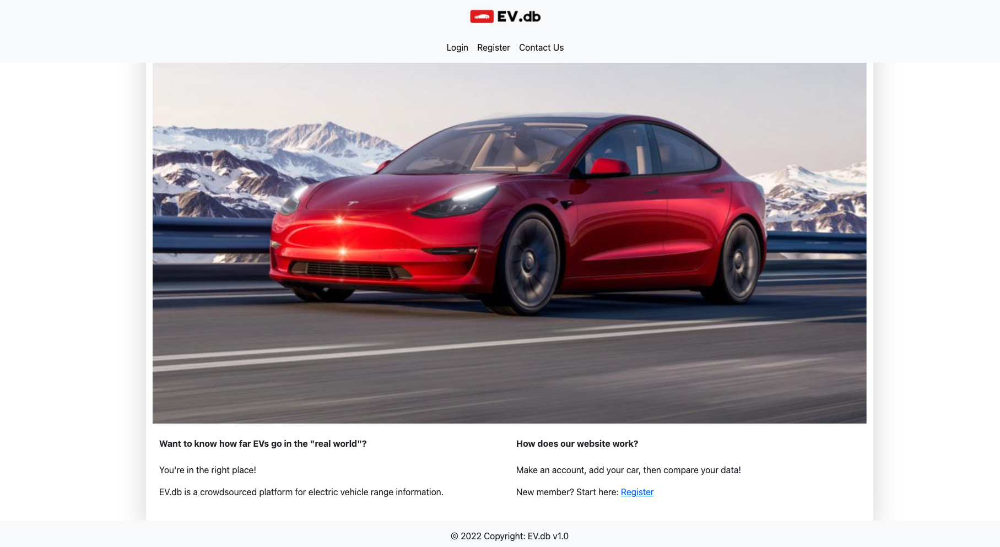

# Backend-Cars

Explanation of what the project is / what it does.
This App is built for the car enthusiast, it allows you to add, update and delete your car model with its specific statistics and features. You also have access to compare several car models of your choice.

What technologies you used.
Node
Express
Sequelize
PostgreSQL
bcrypt
Express ES6 Template Engine
HTML 
CSS
Bootstrap

Screenshots of your project.

List of team members.
Sam Moon 

Victor Brew

Daniel Donato

