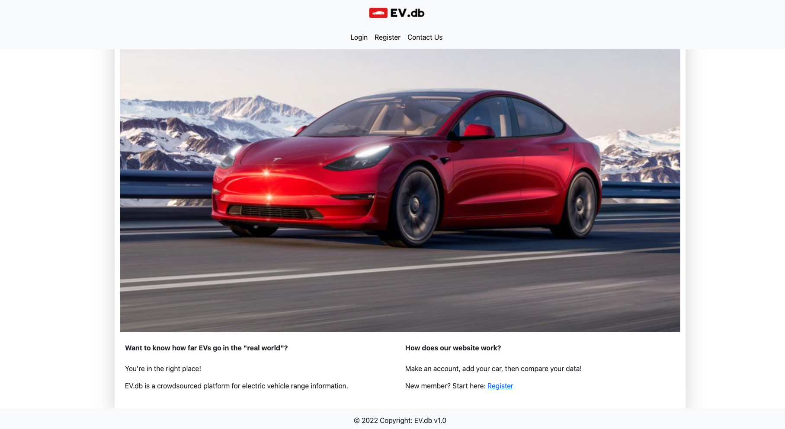

# Full stack project

## About the project:

This App is built for the **car enthusiast**. It allows you to add, update and delete your car model with its specific statistics and features. You also have access to compare several car models of your choice.

## Technologies used:

* Node
* Express
* Sequelize
* PostgreSQL
* bcrypt
* Express ES6 Template Engine
* HTML 
* CSS
* Bootstrap

## Home page:

## Team members:

Sam Moon 

Victor Brew

Daniel Donato

